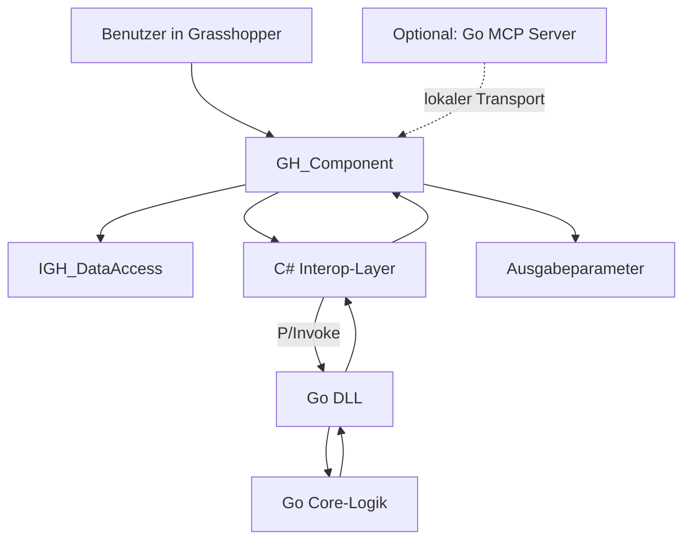
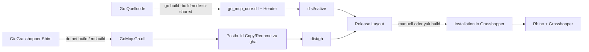

# Eigene Rhino-Grasshopper-Komponentenarchitektur mit Go

## Zusammenfassung für Entscheider

Die zentrale technische Erkenntnis ist eindeutig: Für ein benutzerdefiniertes Grasshopper-Plug-in auf Windows ist **kein rein in Go gebautes `.gha`** der robuste oder offiziell dokumentierte Weg. Die Grasshopper-Seite erwartet .NET-Typen, insbesondere Komponenten, die von `GH_Component` ableiten; Metadaten kommen über `GH_AssemblyInfo`, und Vorinitialisierung ist über `GH_AssemblyPriority.PriorityLoad()` vorgesehen. Go kann dagegen mit `cgo` und `-buildmode=c-shared` eine **native DLL plus Header** erzeugen. Der saubere Entwurf ist deshalb **hybrid**: ein dünner C#-Grasshopper-Shim als `.gha` und ein Go-Rechenkern als native DLL. citeturn28search4turn16search5turn16search3turn16search1turn13search0turn23search0

Das verlinkte Referenzprojekt `grasshopper-mcp` ist architektonisch etwas anderes als ein „Go-Plugin für Grasshopper“: Laut README besteht es aus einem **C#-Grasshopper-Plugin** (`GH_MCP.gha`), einem **Python-MCP-Bridge-Server** und einer **Komponenten-Wissensbasis**; der GHA-Teil stellt einen TCP-Server bereit, der Python-Teil koppelt an Claude Desktop via MCP. Als Referenz ist das nützlich, aber es ist **keine** Blaupause für eine reine Go-Implementierung eines Grasshopper-Komponentenprojekts. Für eine eigene Implementierung sollte es eher als **Anforderungs- und Architekturstudie** denn als Fork-Basis verstanden werden. citeturn10search0turn1view0

Weil die Zielversion von Rhino nicht spezifiziert wurde, ist die wichtigste Scope-Entscheidung die Laufzeitbasis. Offiziell läuft Rhino 8 auf dem .NET-Core-Stack; Rhino 8 startete mit .NET 7, Rhino 8.20 installiert und verwendet standardmäßig .NET 8. Für Windows kann Rhino 8 bei Bedarf weiter unter .NET Framework laufen. Rhino 7 basiert auf .NET Framework 4.8. Für ein **MVP** mit minimalem Risiko ist deshalb **Rhino 8.20+ auf Windows** die beste Zielplattform; wenn **Rhino-7-Kompatibilität** erforderlich ist, sollte die C#-Schicht multi-targeted aufgebaut werden und einen Kompatibilitätspfad für .NET Framework 4.8 erhalten. citeturn29search0turn29search1

Praktisch bedeutet das: **Go übernimmt die Rechenlogik**, **C# übernimmt Komponenten-Lifecycle, Registrierung, Parametrierung, Fehlerdarstellung, Packaging und Rhino/Grasshopper-Integration**. Für ein kleines MVP mit einem bis drei Komponenten ist das realistisch in wenigen Arbeitstagen, wenn Go, C# und Grasshopper-SDK bereits vertraut sind; wenn Grasshopper-SDK, cgo und Windows-Interop neu sind, ist eher ein bis drei Wochen netto einzuplanen. Diese Aufwandsschätzung ist eine technische Projektschätzung, keine Dokumentationsaussage.

## Ausgangslage und Machbarkeitsbefund

Die Dokumentationsbasis von entity["organization","Robert McNeel & Associates","3d software vendor"] und die Interop-Hinweise von entity["company","Microsoft","software company"] führen zu einem klaren Befund: Grasshopper-Komponenten sind .NET-Komponentenbibliotheken. Die offizielle Dokumentation beschreibt Grasshopper als .NET-/RhinoCommon-Plug-in und erläutert, dass Komponentenbibliotheken auf diesen Assemblys aufbauen. `GH_Component` ist die dokumentierte Basisklasse für benutzerdefinierte Komponenten, und `GH_AssemblyInfo` ist der vorgesehene Metadaten-Hook für das GHA-Projekt. COM-Interop existiert in .NET zwar als Technik, ist für einen **in-process** Grasshopper-Komponentenaufbau aber **nicht die primäre Brücke**; die relevante Interop-Schicht ist hier **native Interop via P/Invoke / `LibraryImport` / `DllImport`**. citeturn31search7turn28search4turn16search5turn15search0turn15search2

Das Referenzrepo auf entity["company","GitHub","developer platform"] verfolgt ein anderes Ziel: Es koppelt Grasshopper an Claude Desktop über MCP, indem ein Grasshopper-Plugin einen TCP-Server anbietet und ein Python-Bridge-Server darüber Werkzeugaufrufe vermittelt. Das ist ein **Bridge-/Transport-Design**, kein kompakter Grasshopper-Komponentenbaukasten mit Go als Rechenkern. Wer das Repo direkt „auf Go umschreibt“, übernimmt implizit auch dessen Python-/Bridge-Annahmen, obwohl für ein gewöhnliches Grasshopper-Komponentenprojekt diese Schichten nicht zwingend nötig sind. citeturn10search0turn1view0

Daraus folgt analytisch eine saubere Trennung in zwei Zielbilder. Das erste ist der **eigentliche Managed-Component-Weg**: C#-Shim plus Go-DLL in-process. Das zweite ist der **transportorientierte Weg**: eine Go-Serverkomponente außerhalb von Rhino und ein dünner Grasshopper- oder Rhino-Adapter innerhalb von Rhino. Offiziell gibt es mit **Hops** sogar ein dokumentiertes Muster, externe Funktionen in Grasshopper einzubinden, inklusive Parallelisierung und asynchronen längeren Berechnungen; das bestätigt, dass ein out-of-process-Ansatz architektonisch legitim ist, aber eben ein anderes Produkt als eine direkte Komponentenbibliothek ergibt. citeturn31search2turn10search0

Für das hier gewünschte Ergebnis ist der **hybride in-process-Weg** das bessere Fundament: Er liefert die kürzeste Latenz, die natürlichste Bedienung im Komponenten-Canvas und den geringsten Overhead bei Packaging und Installation. Ein zusätzlicher Go-MCP-Server kann später als **Vollausbau** ergänzt werden, wenn LLM-Integration oder Remote-Werkzeuge wirklich benötigt werden. citeturn28search4turn16search1turn10search0

## Zielbild und Umfang

Wenn das Produktziel **eigene Grasshopper-Komponenten** ist, sollte das MVP bewusst klein bleiben. „Klein“ heißt in diesem Kontext: **eine** Bibliothek, **ein** Go-Core, **eine bis drei** exemplarische Komponenten, **keine** COM- oder Socket-Architektur, **keine** LLM-Anbindung im ersten Schritt und **eine** saubere Packaging-Story für Windows. Wenn das Produktziel dagegen wirklich „MCP wie im Referenzrepo“ ist, gehört eine zusätzliche Go-Server-Schicht in den Vollausbau, nicht in das erste Inkrement. Die Abgrenzung spart Wochen an Integrationsaufwand. citeturn10search0turn31search2

Die folgende Scope-Gegenüberstellung ist eine empfohlene Projektabgrenzung auf Basis der Rhino-/Grasshopper-Plugin-Mechanik, der Rhino-8-Laufzeitentwicklung und des Referenzrepos. citeturn29search0turn29search1turn10search0

| Dimension         | Minimal viable MCP                          | Full-featured Umsetzung                                            |
| ----------------- | ------------------------------------------- | ------------------------------------------------------------------ |
| Zielplattform     | Rhino 8.20+ auf Windows                     | Rhino 7/8 auf Windows, optional spätere Mac-Perspektive            |
| Architektur       | C# `.gha` + Go-DLL                          | C# `.gha` + Go-DLL + optionaler Go-MCP-Server                      |
| Komponentenanzahl | 1–3 Beispielkomponenten                     | Mehrere Kategorien, Optionen, Upgrade-Pfade                        |
| Interop           | Nur native Interop                          | Native Interop plus optionale Prozess-/Transportebene              |
| Packaging         | Manuelles Kopieren oder einfacher Yak-Build | Yak-Distributionen, CI-Artefakte, Versionierung                    |
| Tests             | Go-Unit-Tests + Smoke-Test in Rhino         | Go-Unit-Tests, .NET-Tests, Packaging-Tests, Kompatibilitäts-Checks |
| Versionierung     | Feste Component GUIDs ab Tag 1              | Zusätzlich Upgrade-Mechanismen bei Breaking Changes                |
| MCP/LLM-Anbindung | Nein                                        | Optional, falls fachlich wirklich benötigt                         |

Aus Projektsicht ist die wichtigste Entscheidung nicht „Go oder C#“, sondern **wo Go endet und wo Grasshopper beginnt**. Für das MVP sollte Go **nur** den Rechenkern und datennahe Logik enthalten. Alles, was mit `GH_Component`, Parametern, Canvas-Exposition, Runtime-Messages, Assembly-Metadaten und Packaging zu tun hat, gehört in die C#-Schicht. Das minimiert Interop-Fläche und maximiert Debuggability. citeturn28search4turn28search0turn16search5

## Wissensbasis und Toolchain

Technisch benötigen Sie nicht „ein bisschen von allem“, sondern vier klar getrennte Wissensblöcke. Erstens: **Go mit Modulen und Package-Struktur**. Zweitens: **cgo und native ABI-Fragen** wie Symbol-Exporte, Datentyp-Mapping, Speicherlebensdauer und Pointer-Regeln. Drittens: **Windows-.NET-Interop** mit `LibraryImport` oder `DllImport`, Library-Loading, Signaturtreue und Handle-/String-Marshalling. Viertens: **Rhino/Grasshopper-SDK-Grundlagen** wie `GH_Component`, `GH_AssemblyInfo`, `GH_AssemblyPriority`, Parameterregistrierung und `SolveInstance`. COM-Kenntnis ist für dieses Projekt **sekundär**; sie wird erst relevant, wenn Sie später Rhino extern automatisieren oder vorhandene COM-Objekte integrieren wollen. citeturn23search0turn15search0turn15search2turn28search4turn16search5turn16search3turn28search0

Stand **27. April 2026** ist **Go 1.26.2** die aktuelle stabile Hauptlinie; die Go-Release-Historie dokumentiert zugleich die Support-Policy von „zwei neueren Major-Releases“. Für dieses Vorhaben ist das relevant, weil `cgo`, `-buildmode=c-shared`, Exportheader und Plattformvariablen unmittelbar vom Go-Tooling abhängen. Die Go-Dokumentation beschreibt den Standard-C-Compiler in diesem Kontext typischerweise als **gcc oder clang**, und sie weist ausdrücklich darauf hin, dass `cgo` bei Cross-Compilation standardmäßig deaktiviert ist und dann einen expliziten Ziel-Compiler erfordert. citeturn24search0turn23search0turn13search0turn14search1

Offiziell ist auf Windows die primäre Rhino-/Grasshopper-Entwicklungsumgebung **Visual Studio „proper“** mit den RhinoCommon-/Grasshopper-Templates; für Build- und CI-Szenarien ist aber wichtig, dass `dotnet build` intern **MSBuild** nutzt und dass **Visual Studio Build Tools** genau für das Kommandozeilen-Bauen von Visual-Studio-Projekten vorgesehen sind. Das heißt praktisch: Für lokale Entwicklung und Debugging ist vollwertiges Visual Studio der komfortabelste Weg; für reproduzierbare Build-Agents genügen häufig .NET SDK plus Build Tools. citeturn31search0turn17search0turn22search2turn21search2turn27search1turn27search4

Die folgende Matrix trennt sauber zwischen **wirklich erforderlich**, **empfohlen** und **nur in Spezialfällen sinnvoll**. Sie kombiniert offizielle Rhino-, Go- und Microsoft-Dokumentation mit einer konkreten Projektentscheidung für Windows. citeturn24search0turn23search0turn31search0turn29search0turn29search1turn15search0

| Werkzeug / Abhängigkeit           | MVP                    | Vollausbau                       | Begründung                                                        |
| --------------------------------- | ---------------------- | -------------------------------- | ----------------------------------------------------------------- |
| Go 1.26.x                         | Erforderlich           | Erforderlich                     | Aktuelle stabile Go-Linie; nötig für `cgo` und `c-shared`         |
| `cgo`                             | Erforderlich           | Erforderlich                     | Go-DLL mit exportierten C-Symbolen                                |
| C-Compiler für `cgo`              | Erforderlich           | Erforderlich                     | Praktisch meist MinGW-w64 GCC oder LLVM/Clang im `PATH`           |
| .NET SDK 8                        | Empfohlen              | Erforderlich                     | Sauberer Fit zu Rhino 8.20+                                       |
| Visual Studio 2022                | Empfohlen              | Empfohlen                        | Offiziell beste Windows-Authoring-/Debugging-Story                |
| Visual Studio Build Tools         | Optional               | Empfohlen                        | Headless Build, CI, MSBuild-Workloads                             |
| MSBuild                           | Optional               | Empfohlen                        | `dotnet build` nutzt ihn ohnehin; direkter Aufruf bleibt nützlich |
| .NET Framework 4.8 Targeting Pack | Nicht für Rhino-8-only | Erforderlich bei Rhino-7-Support | Rhino 7 basiert auf .NET Framework 4.8                            |
| SWIG                              | Nicht sinnvoll         | Nur Spezialfall                  | Nur für große C/C++-Wrapperflächen; ersetzt nicht den C#-Shim     |
| COM-Interop-Know-how              | Optional               | Optional                         | Nicht Kern des MVP, nur für spätere externe Automation            |

Für dieses Vorhaben ist eine kleine, aber wichtige Unterscheidung entscheidend: **MinGW-w64/clang** deckt den von Go dokumentierten `cgo`-Kompilierpfad ab; **Visual Studio / Build Tools** decken den **.NET-/MSBuild-Teil** ab. Beide Werkzeugfamilien lösen unterschiedliche Probleme. Wer das vermischt, verliert meist Zeit in Buildfehlern, die gar nicht auf derselben Ebene liegen. citeturn23search0turn22search2turn27search1turn27search4

## Architektur- und Repository-Entwurf

Die sinnvollste neue Repository-Architektur ist **kein Fork des Referenzrepos**, sondern ein neues Monorepo mit sauberer Schichtung. Das Referenzrepo trennt Python-Bridge und C#-Grasshopper-Plug-in; Ihre neue Struktur sollte stattdessen **Go-Core**, **C#-Grasshopper-Shim**, **Buildskripte**, **Tests** und **Yak-Paketierung** explizit trennen. Das reduziert die Interop-Fläche, macht den Go-Core isoliert testbar und erlaubt später, optional einen Go-MCP-Server hinzuzunehmen, ohne den Grasshopper-Teil umzubauen. citeturn10search0turn22search2turn13search0

Die folgende Vergleichstabelle stellt das Referenzrepo der empfohlenen Zielstruktur gegenüber. Die Fakten zum Referenzrepo stammen aus README, Verzeichnisstruktur, Sprachmix und Installationsbeschreibung des Repos. citeturn10search0turn1view0

| Aspekt               | Referenzrepo `grasshopper-mcp`     | Neuer Vorschlag `gomcp-gh`                                            |
| -------------------- | ---------------------------------- | --------------------------------------------------------------------- |
| Primäre Sprache      | C# + Python                        | C# + Go                                                               |
| Hauptzweck           | MCP-Bridge zu Claude Desktop       | Grasshopper-Komponentenbibliothek mit Go-Rechenkern                   |
| Grasshopper-Frontend | `GH_MCP.gha` mit TCP-Server        | Dünne `.gha`-Bibliothek mit Komponenten und Interop                   |
| Rechenkern           | Python-Bridge + Wissensbasis       | Go-Core als native DLL                                                |
| Build-Pipeline       | Visual Studio + Python/PyPI        | Go `c-shared` + `dotnet build` / MSBuild                              |
| Transportebene       | TCP zwischen GHA und Python-Bridge | Im MVP keine; optional später lokaler MCP-Server                      |
| Packaging            | GHA-Datei + Python-Paket           | GHA + native DLL, optional Yak-Paket                                  |
| Lizenz               | MIT                                | MIT empfohlen; Apache-2.0 nur, wenn Sie bewusst Patentklauseln wollen |

Die folgende Projektstruktur ist für ein neues Repository zweckmäßig. Sie ist bewusst auf Testbarkeit, klare Verantwortlichkeiten und spätere Erweiterbarkeit ausgelegt.

| Pfad                             | Zweck                                  |
| -------------------------------- | -------------------------------------- |
| `go.mod`                         | Go-Moduldefinition                     |
| `global.json`                    | Pinning der .NET-SDK-Version           |
| `README.md`                      | Architektur, Build, Installation       |
| `cmd/mcpcore/main.go`            | Dünner cgo-Export-Layer                |
| `internal/core/`                 | Fachliche Logik in reinem Go           |
| `internal/ffi/`                  | Hilfstypen für Marshaling, falls nötig |
| `src/GoMcp.Gh/GoMcp.Gh.csproj`   | C#-Grasshopper-Projekt                 |
| `src/GoMcp.Gh/AssemblyInfo.cs`   | `GH_AssemblyInfo`-Implementierung      |
| `src/GoMcp.Gh/PriorityLoader.cs` | `GH_AssemblyPriority`-Bootstrap        |
| `src/GoMcp.Gh/Interop/Native.cs` | `LibraryImport`/`DllImport`-Signaturen |
| `src/GoMcp.Gh/Components/`       | Einzelne `GH_Component`-Klassen        |
| `build/build.ps1`                | Lokaler Windows-Build                  |
| `build/package.ps1`              | Packaging und Layout                   |
| `yak/manifest.yml`               | Paket-Metadaten für Yak                |
| `tests/go/`                      | Go-Unit-Tests                          |
| `tests/dotnet/`                  | .NET-Smoke- und Interop-Tests          |
| `artifacts/`                     | Build-Artefakte                        |
| `dist/`                          | Installations- oder Release-Layout     |

Die Interaktion der Schichten sollte so aussehen:



Der Plugin-Lifecycle in Grasshopper ist dabei klar definiert. Zuerst kann `GH_AssemblyPriority.PriorityLoad()` genau einmal vor dem Laden der Komponenten laufen. Dann liefert `GH_AssemblyInfo` Bibliotheksmetadaten. Die eigentlichen Komponenten sind .NET-Klassen, die von `GH_Component` ableiten, einen öffentlichen leeren Konstruktor mit `base(...)` bereitstellen, ihre Parameter registrieren und bei jeder Lösung über `SolveInstance` rechnen. Genau an dieser Stelle ruft der C#-Shim dann den Go-Core auf. citeturn16search3turn16search1turn16search5turn28search4turn28search0turn17search0

## Windows-Einrichtung, Build und Minimalbeispiel

### Setup auf Windows

Die offizielle Windows-Dokumentation von Rhino empfiehlt Visual Studio für Grasshopper-Authoring und Debugging. Für Ihr Projekt reichen funktional drei Dinge: eine installierte Rhino-/Grasshopper-Umgebung, das Go-Tooling und eine .NET-Build-Umgebung. Die Rhino-Installationswurzel lässt sich aus der Registry lesen; McNeel dokumentiert dafür den Schlüssel `HKLM\SOFTWARE\McNeel\Rhinoceros\<version>\Install` mit dem Wert `InstallPath`. Grasshopper dokumentiert zusätzlich den Begriff `PluginFolder` als Verzeichnis, das `Grasshopper.dll` enthält, und `DefaultAssemblyFolder` als Standardordner für Drittanbieter-GHA-Dateien. citeturn19search2turn19search6turn20search0

Ein sauberer Setup-Ablauf auf einem Windows-Rechner sieht deshalb so aus:

```powershell
# 1) Tooling prüfen
go version
dotnet --info

# 2) Registry-basiert Rhino finden
$rhinoInstall = (Get-ItemProperty 'HKLM:\SOFTWARE\McNeel\Rhinoceros\8.0\Install').InstallPath
$env:RHINO_INSTALL_DIR = $rhinoInstall

# 3) Diese Variablen bewusst explizit setzen
$env:RHINO_SYSTEM_DIR = Join-Path $env:RHINO_INSTALL_DIR 'System'
$env:GRASSHOPPER_PLUGIN_DIR = Join-Path $env:RHINO_INSTALL_DIR 'Plug-ins\Grasshopper'   # typischer Standardpfad, prüfen falls abweichend
$env:CGO_ENABLED = "1"
$env:GOOS = "windows"
$env:GOARCH = "amd64"
$env:CC = "gcc"   # oder voller Pfad zu MinGW-w64 GCC / Clang
```

Wenn Sie **Rhino 8 only** bauen, ist `.NET 8` die pragmatische Wahl, weil Rhino 8.20+ standardmäßig darauf läuft. Wenn Sie **Rhino 7** unterstützen müssen, brauchen Sie zusätzlich das `.NET Framework 4.8`-Targeting-Pack und einen Kompatibilitätspfad in der C#-Schicht. Build-seitig gilt außerdem: `dotnet build` nutzt MSBuild bereits intern; ein eigener `msbuild.exe`-Aufruf ist also häufig Komfort oder CI-Entscheidung, nicht technische Pflicht. citeturn29search0turn29search1turn22search2turn21search2

Wer den Build nicht aus Visual Studio heraus, sondern per CLI oder CI fahren will, kann Visual Studio Build Tools verwenden. Microsoft dokumentiert dafür einerseits die allgemeinen Build Tools und andererseits die Workloads für MSBuild und .NET-/NetFX-Komponenten. Für Rhino-7-Kompatibilität ist das 4.8-Targeting-Pack relevant; für Rhino-8-only genügt meist .NET SDK 8 plus MSBuild-Workload. citeturn27search1turn27search4

### Build-Flow

Der Build-Prozess sollte von Anfang an zweistufig modelliert werden: **zuerst Go**, **danach C#**, **danach Packaging**. Genau diese Entkopplung macht den Core testbar und den Grasshopper-Teil austauschbar. Go dokumentiert für diesen Zweck `-buildmode=c-shared`, und .NET dokumentiert `dotnet build` als Build-Einstieg für Projekt, Lösung oder file-based app. citeturn13search0turn23search0turn22search2



### Minimalbeispiel für den Go-Core

Für das MVP sollte der Go-Core **so dünn wie möglich** starten. Idealerweise lebt die eigentliche Logik in `internal/core`; `cmd/mcpcore` exportiert nur die notwendigen Symbole. Das Beispiel unten zeigt bewusst den kleinstmöglichen stabilen Kern: eine exportierte Rechenfunktion ohne String- oder Pointer-Komplexität.

```go
// cmd/mcpcore/main.go
package main

/*
#include <stdint.h>
*/
import "C"

//export AddNumbers
func AddNumbers(a, b C.double) C.double {
	return a + b
}

func main() {}
```

Build-Befehl:

```powershell
go build -buildmode=c-shared -o .\artifacts\native\go_mcp_core.dll .\cmd\mcpcore
```

Go dokumentiert, dass `cgo` exportierte Go-Funktionen für C-Sichtbarkeit erzeugen kann und dabei bei Bedarf auch einen Exportheader schreibt; `-buildmode=c-shared` baut die Shared Library, und die exportierten Symbole sind genau die mit `//export` markierten Funktionen. citeturn23search0turn13search0

### Minimalbeispiel für die C#-Grasshopper-Schicht

Für Rhino 8 only ist `LibraryImport` der modernere Interop-Weg. Microsoft empfiehlt ihn, wenn .NET 7+ das Ziel ist. Wenn Sie Rhino-7-Kompatibilität benötigen, ersetzen Sie diesen Teil durch `DllImport` und einen `net48`-Pfad. Grasshopper selbst verlangt daneben den Komponententyp, den leeren Konstruktor und die Parameterregistrierung. citeturn15search0turn29search0turn28search4turn28search0

```csharp
// src/GoMcp.Gh/Interop/Native.cs
using System;
using System.IO;
using System.Reflection;
using System.Runtime.InteropServices;

namespace GoMcp.Gh.Interop;

internal static partial class Native
{
    private static IntPtr _handle;

    internal static void EnsureLoaded()
    {
        if (_handle != IntPtr.Zero) return;

        var asmDir = Path.GetDirectoryName(Assembly.GetExecutingAssembly().Location)!;
        var dllPath = Path.Combine(asmDir, "native", "go_mcp_core.dll");
        _handle = NativeLibrary.Load(dllPath);
    }

    [LibraryImport("go_mcp_core", EntryPoint = "AddNumbers")]
    internal static partial double AddNumbers(double a, double b);
}
```

```csharp
// src/GoMcp.Gh/PriorityLoader.cs
using Grasshopper.Kernel;
using Rhino;
using GoMcp.Gh.Interop;
using System;

namespace GoMcp.Gh;

public sealed class PriorityLoader : GH_AssemblyPriority
{
    public override GH_LoadingInstruction PriorityLoad()
    {
        try
        {
            Native.EnsureLoaded();
            return GH_LoadingInstruction.Proceed;
        }
        catch (Exception ex)
        {
            RhinoApp.WriteLine($"GoMcp load failed: {ex.Message}");
            return GH_LoadingInstruction.Abort;
        }
    }
}
```

```csharp
// src/GoMcp.Gh/Components/GoAddComponent.cs
using Grasshopper.Kernel;
using GoMcp.Gh.Interop;
using System;

namespace GoMcp.Gh.Components;

public sealed class GoAddComponent : GH_Component
{
    public GoAddComponent()
        : base("Go Add", "GAdd", "Addiert zwei Zahlen über den Go-Core", "GoMcp", "Core")
    {
    }

    public override Guid ComponentGuid => new("1F1E96AC-9E1C-4A0E-8E10-1E8DA8C1B52B");

    protected override void RegisterInputParams(GH_Component.GH_InputParamManager pManager)
    {
        pManager.AddNumberParameter("A", "A", "Erste Zahl", GH_ParamAccess.item);
        pManager.AddNumberParameter("B", "B", "Zweite Zahl", GH_ParamAccess.item);
    }

    protected override void RegisterOutputParams(GH_Component.GH_OutputParamManager pManager)
    {
        pManager.AddNumberParameter("Summe", "S", "A + B", GH_ParamAccess.item);
    }

    protected override void SolveInstance(IGH_DataAccess DA)
    {
        double a = 0.0, b = 0.0;
        if (!DA.GetData(0, ref a)) return;
        if (!DA.GetData(1, ref b)) return;

        try
        {
            var result = Native.AddNumbers(a, b);
            DA.SetData(0, result);
        }
        catch (Exception ex)
        {
            AddRuntimeMessage(GH_RuntimeMessageLevel.Error, ex.Message);
        }
    }
}
```

```csharp
// src/GoMcp.Gh/AssemblyInfo.cs
using Grasshopper.Kernel;
using System.Drawing;

namespace GoMcp.Gh;

public sealed class GoMcpAssemblyInfo : GH_AssemblyInfo
{
    public override string Name => "GoMcp.Gh";
    public override Bitmap Icon => null;
    public override string Description => "Grasshopper-Komponenten mit Go-Rechenkern";
    public override string AuthorName => "Ihr Name";
    public override string AuthorContact => "you@example.com";
    public override string Version => "0.1.0";
    public override GH_LibraryLicense License => GH_LibraryLicense.opensource;
}
```

Dieses Minimalbeispiel deckt den dokumentierten Lifecycle vollständig ab: `PriorityLoad()` lädt oder validiert die native DLL vor der Komponenteninitialisierung, `GH_AssemblyInfo` liefert Bibliotheksmetadaten, die Komponente registriert Eingänge/Ausgänge, und `SolveInstance` ruft die Go-Funktion auf. Damit ist die kleinste konsistente Grasshopper/Go-Architektur erreicht. citeturn16search1turn16search3turn16search5turn28search4turn28search0

### Praktische Build-Kommandos

Ein funktionaler lokaler Windows-Build kann mit zwei klaren Schritten starten:

```powershell
# Go-Core
go build -buildmode=c-shared -o .\artifacts\native\go_mcp_core.dll .\cmd\mcpcore

# C#-Shim
dotnet build .\src\GoMcp.Gh\GoMcp.Gh.csproj -c Release -bl:.\artifacts\logs\gh.binlog
```

Danach kopieren Sie `go_mcp_core.dll` in ein Unterverzeichnis wie `native\` neben die gebaute `.gha`. Der `.binlog`-Schalter ist kein Muss, aber für Diagnosearbeit sehr hilfreich, weil MSBuild und `dotnet build` damit reproduzierbare Buildlogs erzeugen. citeturn22search2turn21search2

## Debugging, Tests, Packaging und Installation

### Debugging und Tests

Die offizielle Grasshopper-Dokumentation für Windows empfiehlt den Debug-Loop direkt aus Visual Studio in Rhino/Grasshopper hinein, inklusive Breakpoints in `SolveInstance`. Für dieses Projekt reicht das aber nicht: Sie müssen zusätzlich **den nativen Go-Core** isoliert testen. Die Architektur sollte deshalb so gewählt werden, dass möglichst viel Logik in **reinem Go** lebt und der cgo-Export-Layer dünn bleibt. Dann können Sie den Großteil mit `go test` prüfen und nur die Interop-Schicht separat smoketesten. citeturn17search0turn23search0turn22search3

Pragmatisch funktioniert folgende Testpyramide am besten:

| Ebene                  | Werkzeug              | Ziel                                              |
| ---------------------- | --------------------- | ------------------------------------------------- |
| Go-Unit-Tests          | `go test ./...`       | Fachlogik ohne Rhino-Abhängigkeit prüfen          |
| Native Export-Prüfung  | `dumpbin /exports`    | Sichtbarkeit und Symbolnamen prüfen               |
| .NET-Smoke-Test        | `dotnet test`         | P/Invoke-Signaturen und Ladepfade prüfen          |
| Rhino-Integrationslauf | Visual Studio / Rhino | `SolveInstance`, Parameter, Runtime-Fehler prüfen |
| Kompatibilitätscheck   | `compat.exe`          | Rhino-8-.NET-Core-Kompatibilität absichern        |

Die wichtigsten Diagnosebefehle für den Alltag sind:

```powershell
go test ./...
dotnet test .\tests\dotnet\InteropSmokeTests.csproj
dumpbin /exports .\artifacts\native\go_mcp_core.dll
"C:\Program Files\Rhino 8\System\netcore\compat.exe" -q --check-system-assemblies .\artifacts\gh\GoMcp.Gh.gha
```

Microsoft nennt `dumpbin /exports` explizit als Mittel gegen `EntryPointNotFoundException`; McNeel dokumentiert `compat.exe` für Rhino-8-Kompatibilitätsprüfungen. Gleichzeitig sollte auf Go-Seite `cgo`-Fehlerdiagnostik ernst genommen werden: Die Doku erläutert Pointer-Regeln, `cgocheck` und den Einsatz von `runtime/cgo.Handle`, wenn später Callbacks oder Zustandsobjekte über die Sprachgrenze getragen werden. citeturn15search0turn29search0turn23search0turn19search19

Gerade in frühen Versionen lohnen sich zwei zusätzliche Disziplinen. Erstens: **keine komplexen Structs und keine Strings in der ersten Iteration**. Blittable Zahlen- und Arraytypen reduzieren einen Großteil der Interop-Fehler. Zweitens: **jede Interop-Signatur exakt spiegeln**. Die Microsoft-Best-Practices betonen explizit Signaturtreue, Handle-Sicherheit, Bool-Marshalling und klare Bibliotheksladepfade; fast alle harten Laufzeitfehler in solchen Projekten sind am Ende ABI-, Calling-Convention- oder Lifetime-Probleme. citeturn15search0turn15search1

### Packaging und Installation

Für die **manuelle Installation** ist der Standardpfad der von Grasshopper dokumentierte `DefaultAssemblyFolder`, also der Standardordner für Drittanbieter-GHA-Dateien. Legen Sie Ihre `.gha` und die dazugehörige native DLL als zusammengehöriges Set ab; im Beispiel oben erwartet der Bootstrap die native DLL in `native\go_mcp_core.dll` relativ zur `.gha`. Für einfache interne Verteilung reicht das zunächst aus. citeturn20search0turn20search3

Für eine **saubere Distribution** ist der Rhino Package Manager (**Yak**) der bessere Weg. McNeel dokumentiert sowohl die Erstellung eines Grasshopper-Plug-in-Pakets als auch die Paketstruktur. Seit Rhino 8 unterstützt Yak multi-targeted .NET-Anwendungen, wobei `manifest.yml` außerhalb der Framework-Unterordner liegt. Der Yak-CLI-Pfad auf Windows ist dokumentiert als `"C:\Program Files\Rhino 8\System\yak.exe"`. citeturn12search2turn25search4turn26search1turn12search5

Ein minimales `manifest.yml` kann so aussehen:

```yaml
name: gomcpgh
version: 0.1.0
authors:
  - Ihr Name
description: Grasshopper-Komponenten mit Go-Rechenkern
url: example.invalid
keywords:
  - grasshopper
  - go
  - guid:1f1e96ac-9e1c-4a0e-8e10-1e8da8c1b52b
```

Und die Packaging-/Installationsbefehle so:

```powershell
# Im Paketverzeichnis mit manifest.yml und den zu verteilenden Dateien
"C:\Program Files\Rhino 8\System\yak.exe" build --platform win

# Installation aus Paketquelle
"C:\Program Files\Rhino 8\System\yak.exe" install gomcpgh
```

McNeel dokumentiert außerdem den Distributions-Tag von Yak-Paketen und erläutert, dass der Package Manager kompatible Distributionen pro Rhino-Version und Plattform auswählt. Das ist der richtige Weg, wenn Sie später Rhino-7-/8-Kompatibilität oder verschiedene Runtime-Layouts sauber trennen möchten. citeturn25search4turn12search7turn12search5

### Häufige Fallstricke

Die folgenden Probleme sind in diesem Projekttyp die klassischen Zeitfresser. Die Ursachen sind gut dokumentiert, aber sie zeigen sich oft erst zur Laufzeit.

| Problem                                           | Typische Ursache                                           | Gegenmaßnahme                                                             |
| ------------------------------------------------- | ---------------------------------------------------------- | ------------------------------------------------------------------------- |
| `.gha` lädt, Komponente erscheint aber nicht      | Falscher C#-Projektaufbau oder keine `GH_Component`-Typen  | Auf `GH_Component`, leeren Konstruktor, GUIDs und Metadata-Klassen prüfen |
| `DllNotFoundException`                            | Native DLL liegt nicht am erwarteten Pfad                  | Relative Layouts klar definieren, Bootstrap mit explizitem Load           |
| `EntryPointNotFoundException`                     | Falscher Exportname oder Namensmangling-Annahme            | `dumpbin /exports` prüfen, EntryPoint explizit setzen                     |
| `AccessViolationException`                        | Falsche Signatur, falsches Bool-/String-Marshalling        | Signaturen spiegeln, mit primitiven Typen beginnen                        |
| Cross-Compile schlägt fehl                        | `cgo` ist deaktiviert oder `CC` fehlt                      | Nativ auf Windows bauen oder Ziel-Compiler explizit setzen                |
| Bestehende `.gh`-Dateien brechen nach Refactoring | `ComponentGuid` wurde geändert                             | GUIDs stabil halten; später `IGH_UpgradeObject` für Migrationspfade       |
| Rhino 8 .NET Core verhält sich anders als Rhino 7 | Runtime-Unterschiede zwischen .NET Core und .NET Framework | Früh mit `compat.exe` prüfen und ggf. multi-targeten                      |

Diese Fallstricke sind keine Nebensächlichkeiten. In der Praxis sind **Ladepfad**, **Symbolname**, **Guid-Stabilität** und **Rhino-7/8-Runtime-Unterschiede** die vier größten Risikotreiber. Wer sie von Beginn an als explizite Designentscheidungen behandelt, spart mehr Zeit als mit jeder späteren Optimierung. citeturn15search0turn15search1turn23search0turn14search1turn28search2turn28search5turn29search0

## Aufwand, Risiken, nächste Schritte und Checkliste

Die Aufwandsplanung sollte die Lernkurve ehrlich abbilden. Das folgende Raster ist eine projektspezifische Schätzung für ein kleines Windows-MVP mit ein bis drei Komponenten, Yak optional und ohne LLM-/MCP-Transportebene.

| Profil                                                                | Geschätzter Nettoaufwand | Erwartbares Ergebnis                                          |
| --------------------------------------------------------------------- | -----------------------: | ------------------------------------------------------------- |
| Go + C# + Grasshopper bereits vertraut                                |          3–5 Arbeitstage | Stabiler MVP mit 1–3 Komponenten                              |
| Go stark, Grasshopper/Interop neu                                     |         6–10 Arbeitstage | MVP, aber mit spürbarer Debugging-Zeit                        |
| Grasshopper neu, Interop neu                                          |         8–15 Arbeitstage | MVP erreichbar, aber mit höherem Architektur- und Testaufwand |
| Vollausbau inkl. Rhino 7/8, Yak, Upgrade-Pfade, optionalem MCP-Server |               3–6 Wochen | Produktisierbare Erstversion                                  |

Empfohlen ist ein gestufter Weg. Zuerst ein **Rhino-8-only-MVP** mit einer einzigen Komponente und rein numerischer Signatur. Dann Packaging über Yak. Danach erst zusätzliche Datentypen, Strukturen, Arrays und gegebenenfalls ein optionaler Go-MCP-Server, wenn Sie funktional wirklich in Richtung des Referenzrepos gehen möchten. Diese Reihenfolge passt zu den dokumentierten Rhino-8-Runtime-Gegebenheiten, zur Yak-Paketierung und zu den Interop-Best-Practices. citeturn29search0turn12search2turn25search4turn15search0

Die empfohlene operative Checkliste lautet:

- Rhino-Ziel explizit festlegen: **Rhino 8.20+ only** oder **Rhino 7/8**.
- Neues Repo **grün aufsetzen**, nicht das Referenzrepo forken.
- Go-Core in `internal/core` beginnen; cgo-Layer in `cmd/mcpcore` dünn halten.
- Erste exportierte Funktion rein numerisch halten.
- C#-Shim mit `GH_AssemblyInfo`, `GH_AssemblyPriority` und **einer** `GH_Component`-Klasse bauen.
- Native DLL explizit beim Start laden, nicht auf implizite Suchpfade vertrauen.
- Früh `go test`, `dotnet test`, `dumpbin /exports` und `compat.exe` in den Build aufnehmen.
- Component GUID **sofort sauber generieren** und nie nachträglich „mal schnell“ ändern.
- Erst wenn das lokale manuelle Installieren stabil ist, `yak build` ergänzen.
- Einen optionalen Go-MCP-Server nur dann hinzufügen, wenn der fachliche Bedarf wirklich Transport-/LLM-Funktionen verlangt.

In dieser Form entsteht **Ihre eigene Implementierung**: nicht als Übersetzung des Python/C#-Bridge-Repos, sondern als technisch sauberer Grasshopper-Baustein mit Go als Rechenkern und einer leicht erweiterbaren, produktionsfähigen Windows-Architektur.
